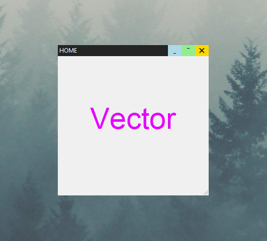

# CTk - Tkinter



## About 🧾
```
Custom window screen for tkinter

```
## Example 🧪

```py

from lib.CTk import CTk
from tkinter import *

test = CTk("HOME")
Label(test,text="Vector",font=("Helvetica", 44),pady=90,fg="#e600ff").grid()
test.mainloop()

```